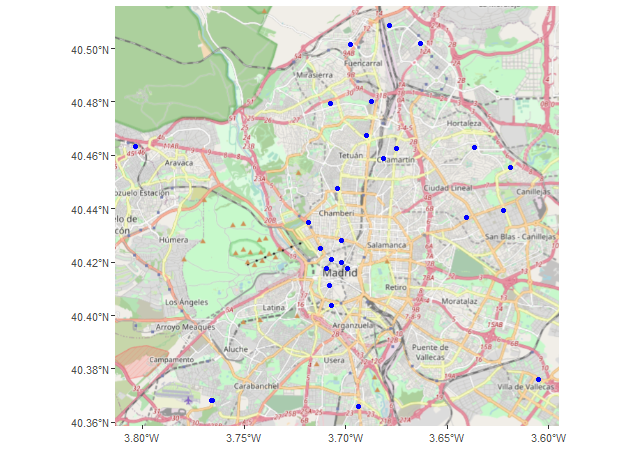

<!-- README.md is generated from README.Rmd. Please edit that file -->

# nominatimlite 

<!-- badges: start -->

[](https://github.com/dieghernan/nominatimlite/actions/workflows/check-full.yaml)
[](https://codecov.io/gh/dieghernan/nominatimlite)
[](https://github.com/dieghernan/nominatimlite)
[](https://www.repostatus.org/#concept)

<!-- badges: end -->

The goal of `nominatimlite` is to provide a light interface for
geocoding addresses, based on the [Nominatim
API](https://nominatim.org/release-docs/latest/). **Nominatim** is a
tool to search [OpenStreetMap](https://www.openstreetmap.org/) data by
name and address
([geocoding](https://wiki.openstreetmap.org/wiki/Geocoding "Geocoding"))
and to generate synthetic addresses of OSM points (reverse geocoding).

This package is derived of the much more mature and complete
`tidygeocoder` package by Jesse Cambon
([link](https://jessecambon.github.io/tidygeocoder/)), that it is
available on CRAN.

## Why `nominatimlite`?

Since `tidygecoder` is much more complete, providing access to several
geocoder services as Mapbox, TomTom or Google, the downloading method is
based on `curl`. In some cases, `curl` could not be available, so
`nominatimlite` uses an approach to overcome this limitation.

This is the main reason for creating this lite version of
`tidygeocoder`.

## Installation

You can install the developing version of `nominatimlite` with:

``` r
devtools::install_github("dieghernan/nominatimlite")
```

Alternatively, you can install `nominatimlite` using the
[r-universe](https://dieghernan.r-universe.dev/ui#builds):

``` r
# Enable this universe
options(repos = c(
    dieghernan = 'https://dieghernan.r-universe.dev',
    CRAN = 'https://cloud.r-project.org'))


install.packages('nominatimlite')
```

## Usage

*Note: examples adapted from `tidygeocoder` package *

In this first example we will geocode a few addresses using the
`geo_lite()` function:

``` r
library(tibble)
library(nominatimlite)

# create a dataframe with addresses
some_addresses <- tribble(
  ~name,                  ~addr,
  "White House",          "1600 Pennsylvania Ave NW, Washington, DC",
  "Transamerica Pyramid", "600 Montgomery St, San Francisco, CA 94111",
  "Willis Tower",         "233 S Wacker Dr, Chicago, IL 60606"
)

# geocode the addresses
lat_longs <- geo_lite(some_addresses$addr, lat = "latitude", long = "longitude")
```

Only latitude and longitude are returned from the geocoder service in
this example, but `full_results = TRUE` can be used to return all of the
data from the geocoder service.

| query                                      | latitude |  longitude | address                                                                                                                                                |
|:-------------------------------------------|---------:|-----------:|:-------------------------------------------------------------------------------------------------------------------------------------------------------|
| 1600 Pennsylvania Ave NW, Washington, DC   | 38.89770 |  -77.03655 | White House, 1600, Pennsylvania Avenue Northwest, Washington, District of Columbia, 20500, United States                                               |
| 600 Montgomery St, San Francisco, CA 94111 | 37.79520 | -122.40279 | Transamerica Pyramid, 600, Montgomery Street, Chinatown, San Francisco, San Francisco City and County, San Francisco, California, 94111, United States |
| 233 S Wacker Dr, Chicago, IL 60606         | 41.87887 |  -87.63591 | Willis Tower, 233, South Wacker Drive, Printer’s Row, Loop, Chicago, Cook County, Illinois, 60606, United States                                       |

To perform reverse geocoding (obtaining addresses from geographic
coordinates), we can use the `reverse_geo_lite()` function. The
arguments are similar to the `geo_lite()` function, but now we specify
the input data columns with the `lat` and `long` arguments. The dataset
used here is from the geocoder query above. The single line address is
returned in a column named by the `address`.

``` r
reverse <- reverse_geo_lite(
  lat = lat_longs$latitude, long = lat_longs$longitude,
  address = "address_found"
)
```

| address\_found                                                                                                                                         |      lat |        lon |
|:-------------------------------------------------------------------------------------------------------------------------------------------------------|---------:|-----------:|
| White House, 1600, Pennsylvania Avenue Northwest, Washington, District of Columbia, 20500, United States                                               | 38.89770 |  -77.03655 |
| Transamerica Pyramid, 600, Montgomery Street, Chinatown, San Francisco, San Francisco City and County, San Francisco, California, 94111, United States | 37.79520 | -122.40279 |
| Willis Tower, 233, South Wacker Drive, Printer’s Row, Loop, Chicago, Cook County, Illinois, 60606, United States                                       | 41.87887 |  -87.63591 |

For more advance users, see [Nominatim
docs](https://nominatim.org/release-docs/latest/api/Search/) to check
the parameters available.

## Map your results

You can easily convert the results of `nominatimlite` into `sf` objects,
that can be mapped with a variety of packages as `ggplot2`, `tmap` or
`leaflet`.

The following example geocodes the restaurants and pubs surrounding
Times Square, New York. The area of search has been restricted to the
geographic bounding box of Times Square.

``` r
library(sf)

library(dplyr)
library(ggplot2)
library(ggspatial)


# Search for Restaurants and Pubs in Times Square, NY

# Times Square, NY, USA
bbox <- c(
  -73.9894467311, 40.75573629,
  -73.9830630737, 40.75789245
)

rest_pubs <- geo_amenity(
  bbox = bbox,
  amenity = c("restaurant", "pub"),
  limit = 10
) %>%
  # Convert to sf object
  st_as_sf(coords = c("lon", "lat"), crs = 4326)


# Plot

ggplot(rest_pubs) +
  annotation_map_tile(type = "osmgrayscale", zoomin = -1) +
  geom_sf(aes(col = query), size = 6) +
  # Limit map to bounding box
  coord_sf(xlim = c(bbox[c(1, 3)]), ylim = bbox[c(2, 4)]) +
  scale_color_manual(values = c("red", "blue")) +
  theme_void() +
  theme(
    legend.position = "bottom",
    legend.title = element_blank()
  )
```


