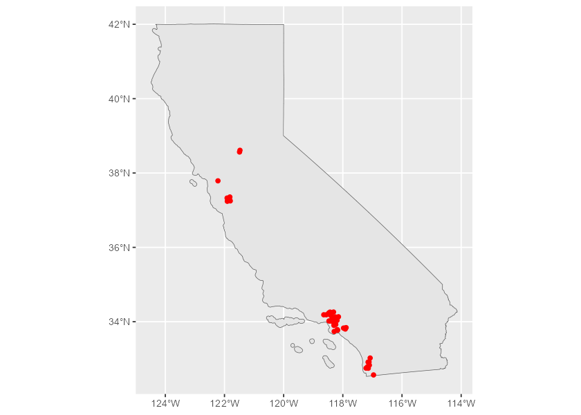
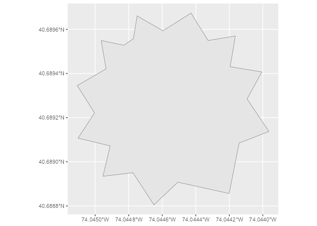
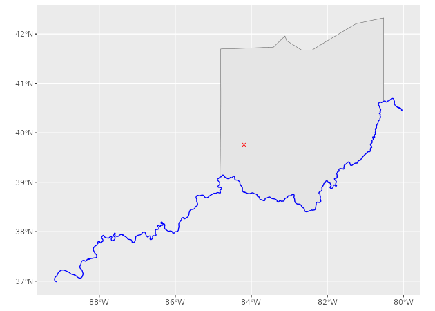

<!-- README.md is generated from README.Rmd. Please edit that file -->

# nominatimlite <a href='https://dieghernan.github.io/nominatimlite/'></a>

<!-- badges: start -->

[](https://CRAN.R-project.org/package=nominatimlite)
[](https://cran.r-project.org/web/checks/check_results_nominatimlite.html)
[](https://CRAN.R-project.org/package=nominatimlite)
[](https://github.com/dieghernan/nominatimlite/actions/workflows/check-full.yaml)
[](https://app.codecov.io/gh/dieghernan/nominatimlite)
[](https://dieghernan.r-universe.dev/nominatimlite)
[](https://www.codefactor.io/repository/github/dieghernan/nominatimlite)
[](https://www.repostatus.org/#active)
[](https://doi.org/10.5281/zenodo.5113195)
[](https://CRAN.R-project.org/package=nominatimlite)

<!-- badges: end -->

The goal of `nominatimlite` is to provide a light interface for
geocoding addresses, based on the [Nominatim
API](https://nominatim.org/release-docs/latest/). **Nominatim** is a
tool to search [OpenStreetMap](https://www.openstreetmap.org/) data by
name and address
([geocoding](https://wiki.openstreetmap.org/wiki/Geocoding "Geocoding"))
and to generate synthetic addresses of OSM points (reverse geocoding).

It also allows to load spatial objects using the `sf` package.

Full site with examples and vignettes on
<https://dieghernan.github.io/nominatimlite/>

## Why `nominatimlite`?

The main goal of `nominatimlite` is to access the Nominatim API avoiding
the dependency on `curl`. In some situations, `curl` may not be
available or accessible, so `nominatimlite` uses base functions to
overcome this limitation.

## Recommended packages

There are other packages much more complete and mature than
`nominatimlite`, that presents similar features:

- [`tidygeocoder`](https://jessecambon.github.io/tidygeocoder/) ([Cambon
  et al. 2021](#ref-R-tidygeocoder)). Allows to interface with
  Nominatim, Google, TomTom, Mapbox, etc. for geocoding and reverse
  geocoding.
- [`osmdata`](https://docs.ropensci.org/osmdata/) ([Padgham et al.
  2017](#ref-R-osmdata)). Great for downloading spatial data from
  OpenStreetMap, via the [Overpass
  API](https://wiki.openstreetmap.org/wiki/Overpass_API).

## Installation

Install `nominatimlite` from
[**CRAN**](https://CRAN.R-project.org/package=nominatimlite):

``` r
install.packages("nominatimlite")
```

You can install the developing version of `nominatimlite` with:

``` r
devtools::install_github("dieghernan/nominatimlite")
```

Alternatively, you can install `nominatimlite` using the
[r-universe](https://dieghernan.r-universe.dev/nominatimlite):

``` r
# Install nominatimlite in R:
install.packages("nominatimlite",
  repos = c(
    "https://dieghernan.r-universe.dev",
    "https://cloud.r-project.org"
  )
)
```

## Usage

### `sf` objects

With `nominatimlite` you can extract spatial objects easily:

``` r
library(nominatimlite)

# Extract some points - Pizza Hut in California

CA <- geo_lite_sf("California", points_only = FALSE)

pizzahut <- geo_lite_sf("Pizza Hut, California",
  limit = 50,
  custom_query = list(countrycodes = "us")
)

library(ggplot2)

ggplot(CA) +
  geom_sf() +
  geom_sf(data = pizzahut, col = "red")
```



You can also extract polygon and line objects (as provided by the
Nominatim API) using the option `points_only = FALSE`:

``` r
sol_poly <- geo_lite_sf("Statue of Liberty, NY, USA", points_only = FALSE) # a building - a polygon

ggplot(sol_poly) +
  geom_sf()
```



``` r
dayton <- geo_lite_sf("Dayton, OH") # default - a point
ohio_state <- geo_lite_sf("Ohio, USA", points_only = FALSE) # a US state - a polygon
ohio_river <- geo_lite_sf("Ohio river", points_only = FALSE) # a river - a line

ggplot() +
  geom_sf(data = ohio_state) +
  geom_sf(data = dayton, color = "red", pch = 4) +
  geom_sf(data = ohio_river, color = "blue")
```



### Geocoding and reverse geocoding

*Note: examples adapted from `tidygeocoder` package*

In this first example we will geocode a few addresses using the
`geo_lite()` function:

``` r
library(tibble)

# create a dataframe with addresses
some_addresses <- tribble(
  ~name,                  ~addr,
  "White House",          "1600 Pennsylvania Ave NW, Washington, DC",
  "Transamerica Pyramid", "600 Montgomery St, San Francisco, CA 94111",
  "Willis Tower",         "233 S Wacker Dr, Chicago, IL 60606"
)

# geocode the addresses
lat_longs <- geo_lite(some_addresses$addr, lat = "latitude", long = "longitude")
#>   |                                                          |                                                  |   0%  |                                                          |=================                                 |  33% (1/3)    |                                                          |=================================                 |  67% (2/3)    |                                                          |==================================================| 100% (3/3)
```

Only latitude and longitude are returned from the geocoder service in
this example, but `full_results = TRUE` can be used to return all of the
data from the geocoder service.

| query                                      | latitude |  longitude | address                                                                                                           |
|:-------------------------------------------|---------:|-----------:|:------------------------------------------------------------------------------------------------------------------|
| 1600 Pennsylvania Ave NW, Washington, DC   | 38.89770 |  -77.03655 | White House, 1600, Pennsylvania Avenue Northwest, Ward 2, Washington, District of Columbia, 20500, United States  |
| 600 Montgomery St, San Francisco, CA 94111 | 37.79520 | -122.40279 | Transamerica Pyramid, 600, Montgomery Street, Financial District, San Francisco, California, 94111, United States |
| 233 S Wacker Dr, Chicago, IL 60606         | 41.87874 |  -87.63596 | Willis Tower, 233, South Wacker Drive, Printer’s Row, Loop, Chicago, Cook County, Illinois, 60606, United States  |

To perform reverse geocoding (obtaining addresses from geographic
coordinates), we can use the `reverse_geo_lite()` function. The
arguments are similar to the `geo_lite()` function, but now we specify
the input data columns with the `lat` and `long` arguments. The dataset
used here is from the geocoder query above. The single line address is
returned in a column named by the `address`.

``` r
reverse <- reverse_geo_lite(
  lat = lat_longs$latitude, long = lat_longs$longitude,
  address = "address_found"
)
#>   |                                                          |                                                  |   0%  |                                                          |=================                                 |  33% (1/3)    |                                                          |=================================                 |  67% (2/3)    |                                                          |==================================================| 100% (3/3)
```

| address_found                                                                                                     |      lat |        lon |
|:------------------------------------------------------------------------------------------------------------------|---------:|-----------:|
| White House, 1600, Pennsylvania Avenue Northwest, Ward 2, Washington, District of Columbia, 20500, United States  | 38.89770 |  -77.03655 |
| Transamerica Pyramid, 600, Montgomery Street, Financial District, San Francisco, California, 94111, United States | 37.79520 | -122.40279 |
| Willis Tower, 233, South Wacker Drive, Printer’s Row, Loop, Chicago, Cook County, Illinois, 60606, United States  | 41.87874 |  -87.63596 |

For more advance users, see [Nominatim
docs](https://nominatim.org/release-docs/latest/api/Search/) to check
the parameters available.

## Citation

<p>
Hernangómez D (2024). <em>nominatimlite: Interface with Nominatim API
Service</em>.
<a href="https://doi.org/10.5281/zenodo.5113195">doi:10.5281/zenodo.5113195</a>,
<a href="https://dieghernan.github.io/nominatimlite/">https://dieghernan.github.io/nominatimlite/</a>.
</p>

A BibTeX entry for LaTeX users is

    @Manual{R-nominatimlite,
      title = {{nominatimlite}: Interface with {Nominatim} {API} Service},
      author = {Diego Hernangómez},
      year = {2024},
      version = {0.2.1.9000},
      doi = {10.5281/zenodo.5113195},
      url = {https://dieghernan.github.io/nominatimlite/},
      abstract = {Lite interface for getting data from OSM service Nominatim <https://nominatim.org/release-docs/latest/>. Extract coordinates from addresses, find places near a set of coordinates, search for amenities and return spatial objects on sf format.},
    }

## References

<div id="refs" class="references csl-bib-body hanging-indent">

<div id="ref-R-tidygeocoder" class="csl-entry">

Cambon, Jesse, Diego Hernangómez, Christopher Belanger, and Daniel
Possenriede. 2021. “<span class="nocase">tidygeocoder</span>: An R
Package for Geocoding.” *Journal of Open Source Software* 6 (65): 3544.
<https://doi.org/10.21105/joss.03544>.

</div>

<div id="ref-R-osmdata" class="csl-entry">

Padgham, Mark, Robin Lovelace, Maëlle Salmon, and Bob Rudis. 2017.
“<span class="nocase">osmdata</span>.” *Journal of Open Source Software*
2 (14): 305. <https://doi.org/10.21105/joss.00305>.

</div>

</div>
