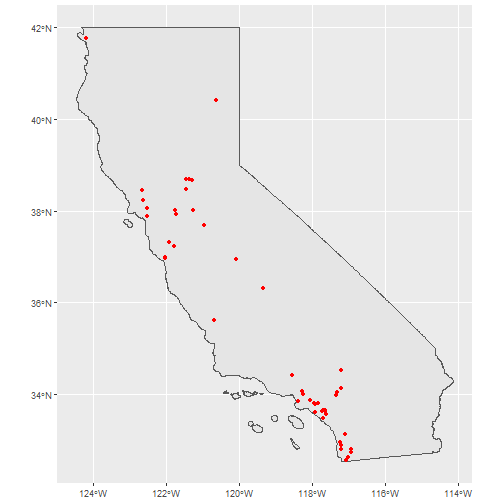
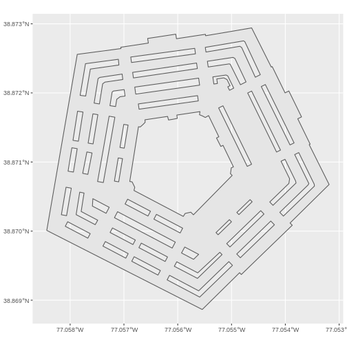

The goal of `nominatimlite` is to provide a light interface for geocoding
addresses, based on the [Nominatim
API](https://nominatim.org/release-docs/latest/). **Nominatim** is a tool to
search [OpenStreetMap](https://www.openstreetmap.org/) data by name and address
([geocoding](https://wiki.openstreetmap.org/wiki/Geocoding "Geocoding")) and to
generate synthetic addresses of OSM points (reverse geocoding).

It also allows to load spatial objects using the `sf` package.

Full site with examples and vignettes on
<https://dieghernan.github.io/nominatimlite/>

## Why `nominatimlite`?

The main goal of `nominatimlite` is to access the Nominatim API avoiding the
dependency on `curl`. In some situations, `curl` may not be available or
accessible, so `nominatimlite` uses base functions to overcome this limitation.

## Recommended packages

There are other packages much more complete and mature than `nominatimlite`,
that presents similar features:

-   [`tidygeocoder`](https://jessecambon.github.io/tidygeocoder/) by Jesse
    Cambon. Allows to interface with Nominatim, Google, TomTom, Mapbox, etc. for
    geocoding and reverse geocoding.
-   [`osmdata`](https://docs.ropensci.org/osmdata/) by Mark Padgham. Great for
    downloading spatial data from OpenStreetMap, via the [Overpass
    API](https://wiki.openstreetmap.org/wiki/Overpass_API).

## Usage

### `sf` objects

With `nominatimlite` you can extract spatial objects easily:


```r
library(nominatimlite)

# Extract some points - McDonalds in California

LA <- geo_lite_sf("California", points_only = FALSE)

McDonalds <- geo_lite_sf("McDonalds, California",
  limit = 50,
  custom_query = list(countrycodes = "us")
)

library(ggplot2)

ggplot(LA) +
  geom_sf() +
  geom_sf(data = McDonalds, col = "red")
```



You can also extract polygon and line objects (if available) using the option
`points_only = FALSE`:


```r

pentagon_poly <- geo_lite_sf("Pentagon", points_only = FALSE)

ggplot(pentagon_poly) +
  geom_sf()
```



### Geocoding and reverse geocoding

*Note: examples adapted from `tidygeocoder` package*

In this first example we will geocode a few addresses using the `geo_lite()`
function:


```r
library(tibble)

# create a dataframe with addresses
some_addresses <- tribble(
  ~name,                  ~addr,
  "White House",          "1600 Pennsylvania Ave NW, Washington, DC",
  "Transamerica Pyramid", "600 Montgomery St, San Francisco, CA 94111",
  "Willis Tower",         "233 S Wacker Dr, Chicago, IL 60606"
)

# geocode the addresses
lat_longs <- geo_lite(some_addresses$addr, lat = "latitude", long = "longitude")
```

Only latitude and longitude are returned from the geocoder service in this
example, but `full_results = TRUE` can be used to return all of the data from
the geocoder service.


|query                                      | latitude|  longitude|address                                                                                                                                                |
|:------------------------------------------|--------:|----------:|:------------------------------------------------------------------------------------------------------------------------------------------------------|
|1600 Pennsylvania Ave NW, Washington, DC   | 38.89770|  -77.03655|White House, 1600, Pennsylvania Avenue Northwest, Washington, District of Columbia, 20500, United States                                               |
|600 Montgomery St, San Francisco, CA 94111 | 37.79520| -122.40279|Transamerica Pyramid, 600, Montgomery Street, Chinatown, San Francisco, San Francisco City and County, San Francisco, California, 94111, United States |
|233 S Wacker Dr, Chicago, IL 60606         | 41.87535|  -87.63576|South Wacker Drive, Printer's Row, Loop, Chicago, Cook County, Illinois, 60606, United States                                                          |

To perform reverse geocoding (obtaining addresses from geographic coordinates),
we can use the `reverse_geo_lite()` function. The arguments are similar to the
`geo_lite()` function, but now we specify the input data columns with the `lat`
and `long` arguments. The dataset used here is from the geocoder query above.
The single line address is returned in a column named by the `address`.


```r
reverse <- reverse_geo_lite(
  lat = lat_longs$latitude, long = lat_longs$longitude,
  address = "address_found"
)
```


|address_found                                                                                                                                          |      lat|        lon|
|:------------------------------------------------------------------------------------------------------------------------------------------------------|--------:|----------:|
|White House, 1600, Pennsylvania Avenue Northwest, Washington, District of Columbia, 20500, United States                                               | 38.89770|  -77.03655|
|Transamerica Pyramid, 600, Montgomery Street, Chinatown, San Francisco, San Francisco City and County, San Francisco, California, 94111, United States | 37.79520| -122.40279|
|South Wacker Drive, Printer's Row, Loop, Chicago, Cook County, Illinois, 60606, United States                                                          | 41.87535|  -87.63576|

For more advance users, see [Nominatim
docs](https://nominatim.org/release-docs/latest/api/Search/) to check the
parameters available.
