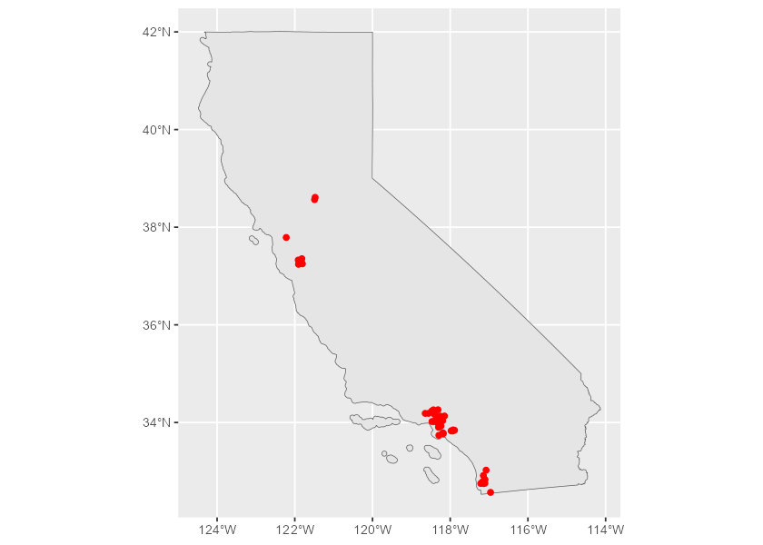
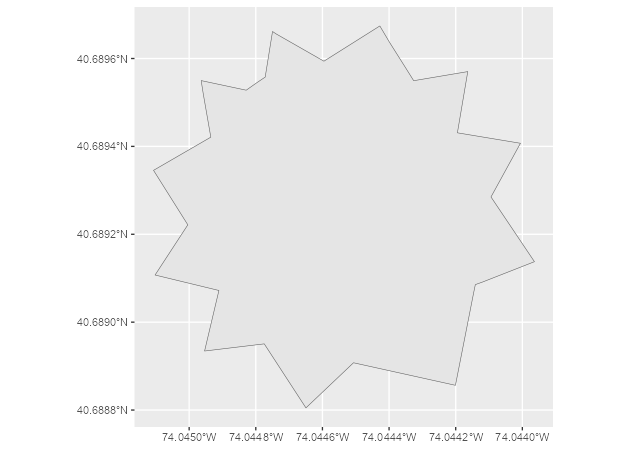

<!-- nominatimlite.qmd is generated from nominatimlite.qmd.orig. Please edit that file -->


The goal of **nominatimlite** is to provide a light interface for geocoding
addresses, based on the [Nominatim
API](https://nominatim.org/release-docs/latest/). It also allows you to load
spatial objects using the **sf** package.

The full site with examples and vignettes is available at
<https://dieghernan.github.io/nominatimlite/>

## What is Nominatim?

**Nominatim** is a tool to search
[OpenStreetMap](https://www.openstreetmap.org/) data by name and address
([geocoding](https://wiki.openstreetmap.org/wiki/Geocoding "Geocoding")) and to
generate synthetic addresses of OSM points (reverse geocoding).

## Why nominatimlite?

The main goal of **nominatimlite** is to access the Nominatim API while avoiding
the dependency on **curl**. In some situations, **curl** may not be available or
accessible, so **nominatimlite** uses base functions to overcome this
limitation.

## Recommended packages

There are other packages that are more complete and mature than
**nominatimlite** and provide similar features:

- [**tidygeocoder**](https://jessecambon.github.io/tidygeocoder/)
  [@R-tidygeocoder]: Provides an interface to Nominatim, Google, TomTom,
  Mapbox, etc. for geocoding and reverse geocoding.
- [**osmdata**](https://docs.ropensci.org/osmdata/) [@R-osmdata]: Great for
  downloading spatial data from OpenStreetMap, via the [Overpass
  API](https://wiki.openstreetmap.org/wiki/Overpass_API).
- [**arcgeocoder**](https://dieghernan.github.io/arcgeocoder/)
  [@R-arcgeocoder]: A lightweight interface for geocoding with the ArcGIS REST
  API service.

## Usage

### `sf` objects

With **nominatimlite** you can extract spatial objects easily:


``` r
library(nominatimlite)

# Extract Pizza Hut locations in California.

CA <- geo_lite_sf("California", points_only = FALSE)

pizzahut <- geo_lite_sf(
  "Pizza Hut, California",
  limit = 50,
  custom_query = list(countrycodes = "us")
)

library(ggplot2)

ggplot(CA) +
  geom_sf() +
  geom_sf(data = pizzahut, col = "red")
```

::: {#fig-phut}
{width="100%"}

Locations of Pizza Hut in California
:::

You can also extract polygon and line objects (if available) using the option
`points_only = FALSE`:


``` r
sol_poly <- geo_lite_sf("Statue of Liberty, NY, USA", points_only = FALSE)

ggplot(sol_poly) +
  geom_sf()
```

::: {#fig-sol}
{width="100%"}

Statue of Liberty
:::

### Geocoding and reverse geocoding

*Note: examples adapted from the **tidygeocoder** package.*

In this first example we will geocode a few addresses using the `geo_lite()`
function:


``` r
library(tibble)

# Create a data frame with addresses.
some_addresses <- tribble(
  ~name, ~addr,
  "White House", "1600 Pennsylvania Ave NW, Washington, DC",
  "Transamerica Pyramid", "600 Montgomery St, San Francisco, CA 94111",
  "Willis Tower", "233 S Wacker Dr, Chicago, IL 60606"
)

# Geocode the addresses.
lat_longs <- geo_lite(
  some_addresses$addr,
  lat = "latitude",
  long = "longitude",
  progressbar = FALSE
)
```

Only latitude and longitude are returned from the geocoder service in this
example, but `full_results = TRUE` can be used to return all of the data from
the geocoder service.

::: {#tbl-geo}


|query                                      | latitude|  longitude|address                                                                                                                                       |
|:------------------------------------------|--------:|----------:|:---------------------------------------------------------------------------------------------------------------------------------------------|
|1600 Pennsylvania Ave NW, Washington, DC   | 38.89764|  -77.03655|White House, 1600, Pennsylvania Avenue Northwest, Ward 2, Washington, District of Columbia, 20500, United States                              |
|600 Montgomery St, San Francisco, CA 94111 | 37.79519| -122.40279|Transamerica Pyramid, 600, Montgomery Street, Financial District, South of Market, San Francisco, California, 94111, United States            |
|233 S Wacker Dr, Chicago, IL 60606         | 41.87874|  -87.63596|Willis Tower, 233, South Wacker Drive, Financial District, Loop, Chicago, South Chicago Township, Cook County, Illinois, 60606, United States |


Example: geocoding addresses
:::

To perform reverse geocoding (obtaining addresses from geographic coordinates),
we can use the `reverse_geo_lite()` function. The arguments are similar to the
`geo_lite()` function, but now we specify the input data columns with the `lat`
and `long` arguments. The dataset used here is from the geocoder query above.
The single-line address is returned in a column named with the `address`
argument.


``` r
reverse <- reverse_geo_lite(
  lat = lat_longs$latitude,
  long = lat_longs$longitude,
  address = "address_found",
  progressbar = FALSE
)
```

::: {#tbl-rev}


|address_found                                                                                                              |      lat|        lon|
|:--------------------------------------------------------------------------------------------------------------------------|--------:|----------:|
|White House, 1600, Pennsylvania Avenue Northwest, Downtown, Ward 2, Washington, District of Columbia, 20500, United States | 38.89764|  -77.03655|
|Sky Bar, Mark Twain Place, Financial District, South of Market, San Francisco, California, 94111, United States            | 37.79519| -122.40254|
|West Adams Street, Financial District, Loop, Chicago, South Chicago Township, Cook County, Illinois, 60675, United States  | 41.87874|  -87.63589|


Example: reverse geocoding addresses
:::

For more advanced users, see the [Nominatim
documentation](https://nominatim.org/release-docs/latest/api/Search/) for the
available parameters.

## References
